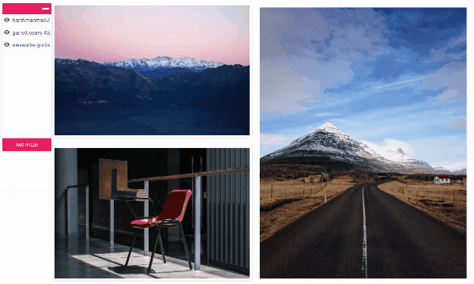

# Interactive Photo Frames

[Live Demo](https://github.com/miksin/interactive-photo-frames)

An interactive in-browser tool for image demonstration.



## Features

- Pure Frontend
  - Run in browser only, no server needed
- Flexible Photo Frames
  - Support arbitrary adjustments of frames such as resizing, zooming, or relocating

## Manual

1. Upload your image files.
1. Drag frames to relocate images.
1. Drag corners to resize frames.
1. Press Alt and scroll mousewheel to scale images.
1. Press Alt and drag to adjust image positions in their frames.

## Project setup

```bash
yarn install
```

### Compiles and hot-reloads for development

```bash
yarn run serve
```

### Compiles and minifies for production

```bash
yarn run build
```
